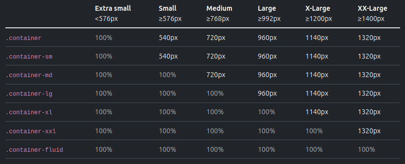
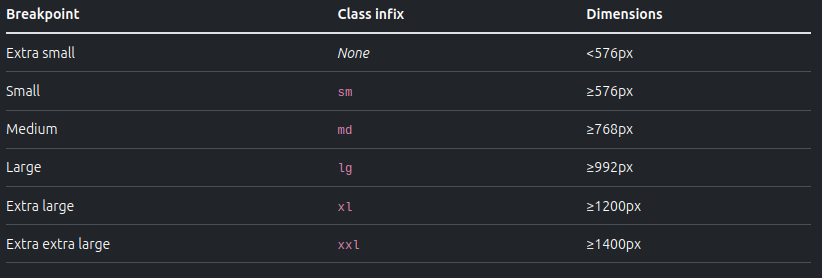

## Bootstrap Install

-   Include Bootstrap’s CSS and JS. Place the `<link>` tag in the `<head>` for our CSS, and the `<script>` tag for our JavaScript bundle (including Popper for positioning dropdowns, poppers, and tooltips) before the closing `</body>`.

```html
<!DOCTYPE html>
<html lang="en">
	<head>
		<meta charset="utf-8" />
		<meta name="viewport" content="width=device-width, initial-scale=1" />
		<title>Bootstrap demo</title>
		<link href="https://cdn.jsdelivr.net/npm/bootstrap@5.3.3/dist/css/bootstrap.min.css" rel="stylesheet" integrity="sha384-QWTKZyjpPEjISv5WaRU9OFeRpok6YctnYmDr5pNlyT2bRjXh0JMhjY6hW+ALEwIH" crossorigin="anonymous" />
	</head>
	<body>
		<h1>Hello, world!</h1>
		<script src="https://cdn.jsdelivr.net/npm/bootstrap@5.3.3/dist/js/bootstrap.bundle.min.js" integrity="sha384-YvpcrYf0tY3lHB60NNkmXc5s9fDVZLESaAA55NDzOxhy9GkcIdslK1eN7N6jIeHz" crossorigin="anonymous"></script>
	</body>
</html>
```

### Viewport meta tag (very important)

-   Since Bootstrap is mobile first the viewport meta tag wil ensure that bootstrap works as intended on all device
    viewport width and heights.

```html
<meta name="viewport" content="width=device-width, initial-scale=1" />
```

### The Container:

The container is the fundamental building block of the Bootstrap 5 layout. It is used to center and align your content on the page, providing a responsive and fluid design. There are two types of containers in Bootstrap 5: the standard container and the fluid container.

-   Standard Container: Centers and aligns content with a fixed-width.
-   Fluid Container: Expands to fill the entire viewport, providing a fully responsive layout.


[Container example](https://getbootstrap.com/docs/5.3/examples/grid/#containers)

### The Grid System:

Bootstrap 5 employs a powerful 12-column grid system to structure and organize content. This responsive grid system allows for easy layout creation by simply dividing the page into columns and rows using the following classes:

-   Container: Wraps the grid and provides a base structure.
-   Row: Defines a horizontal group of columns.
-   Column: Represents an individual column within the row.

The grid system also includes a series of responsive classes for different screen sizes:



-   Extra small (col): <576px
-   Small (col-sm): ≥576px
-   Medium (col-md): ≥768px
-   Large (col-lg): ≥992px
-   Extra large (col-xl): ≥1200px
-   Extra extra large (col-xxl): ≥1400px

## Enable flex behaviors

Apply `display` utilities to create a flexbox container and transform **direct children elements** into flex items. Flex containers and items are able to be modified further with additional flex properties.

```html
<div class="d-flex p-2">I'm a flexbox container!</div>
```
```html
<div class="d-inline-flex p-2">I'm an inline flexbox container!</div>
```

Responsive variations also exist for `.d-flex` and `.d-inline-flex`.

- `.d-flex`
- `.d-inline-flex`
- `.d-sm-flex`
- `.d-sm-inline-flex`
- `.d-md-flex`
- `.d-md-inline-flex`
- `.d-lg-flex`
- `.d-lg-inline-flex`
- `.d-xl-flex`
- `.d-xl-inline-flex`
- `.d-xxl-flex`
- `.d-xxl-inline-flex`


## Direction

Set the direction of flex items in a flex container with direction utilities. In most cases you can omit the horizontal class here as the browser default is `row`. However, you may encounter situations where you needed to explicitly set this value (like responsive layouts).

Use `.flex-row` to set a horizontal direction (the browser default), or `.flex-row-reverse` to start the horizontal direction from the opposite side.

Responsive variations also exist for `flex-direction`.

- `.flex-row`
- `.flex-row-reverse`
- `.flex-column`
- `.flex-column-reverse`
- `.flex-sm-row`
- `.flex-sm-row-reverse`
- `.flex-sm-column`
- `.flex-sm-column-reverse`
- `.flex-md-row`
- `.flex-md-row-reverse`
- `.flex-md-column`
- `.flex-md-column-reverse`
- `.flex-lg-row`
- `.flex-lg-row-reverse`
- `.flex-lg-column`
- `.flex-lg-column-reverse`
- `.flex-xl-row`
- `.flex-xl-row-reverse`
- `.flex-xl-column`
- `.flex-xl-column-reverse`
- `.flex-xxl-row`
- `.flex-xxl-row-reverse`
- `.flex-xxl-column`
- `.flex-xxl-column-reverse`

<!-- ### Flexbox and Alignment

Bootstrap 5 utilizes the power of Flexbox to provide more flexible and advanced layout options. It offers a variety of alignment classes to align content both vertically and horizontally within containers, rows, and columns.

-   Start: Aligns items to the start of the parent element.
-   Center: Centers items within the parent element.
-   End: Aligns items to the end of the parent element.
-   Baseline: Aligns items along their baselines.
-   Stretch: Stretches items to fill the available space. -->

## Justify content

Use `justify-content` utilities on flexbox containers to change the alignment of flex items on the main axis (the x-axis to start, y-axis if `flex-direction: column`). Choose from `start` (browser default), `end`, `center`, `between`, `around`, or `evenly`.

```html
<div class="d-flex justify-content-start">...</div>
<div class="d-flex justify-content-end">...</div>
<div class="d-flex justify-content-center">...</div>
<div class="d-flex justify-content-between">...</div>
<div class="d-flex justify-content-around">...</div>
<div class="d-flex justify-content-evenly">...</div>
```

Responsive variations also exist for `justify-content`.

- `.justify-content-start`
- `.justify-content-end`
- `.justify-content-center`
- `.justify-content-between`
- `.justify-content-around`
- `.justify-content-evenly`
- `.justify-content-sm-start`
- `.justify-content-sm-end`
- `.justify-content-sm-center`
- `.justify-content-sm-between`
- `.justify-content-sm-around`
- `.justify-content-sm-evenly`
- `.justify-content-md-start`
- `.justify-content-md-end`
- `.justify-content-md-center`
- `.justify-content-md-between`
- `.justify-content-md-around`
- `.justify-content-md-evenly`
- `.justify-content-lg-start`
- `.justify-content-lg-end`
- `.justify-content-lg-center`
- `.justify-content-lg-between`
- `.justify-content-lg-around`
- `.justify-content-lg-evenly`
- `.justify-content-xl-start`
- `.justify-content-xl-end`
- `.justify-content-xl-center`
- `.justify-content-xl-between`
- `.justify-content-xl-around`
- `.justify-content-xl-evenly`
- `.justify-content-xxl-start`
- `.justify-content-xxl-end`
- `.justify-content-xxl-center`
- `.justify-content-xxl-between`
- `.justify-content-xxl-around`
- `.justify-content-xxl-evenly`

## Align items

Use `align-items` utilities on flexbox containers to change the alignment of flex items on the cross axis (the y-axis to start, x-axis if `flex-direction: column`). Choose from `start`, `end`, `center`, `baseline`, or `stretch` (browser default).


```html
<div class="d-flex align-items-start">...</div>
<div class="d-flex align-items-end">...</div>
<div class="d-flex align-items-center">...</div>
<div class="d-flex align-items-baseline">...</div>
<div class="d-flex align-items-stretch">...</div>
```


Responsive variations also exist for `align-items`.

- `.align-items-start`
- `.align-items-end`
- `.align-items-center`
- `.align-items-baseline`
- `.align-items-stretch`
- `.align-items-sm-start`
- `.align-items-sm-end`
- `.align-items-sm-center`
- `.align-items-sm-baseline`
- `.align-items-sm-stretch`
- `.align-items-md-start`
- `.align-items-md-end`
- `.align-items-md-center`
- `.align-items-md-baseline`
- `.align-items-md-stretch`
- `.align-items-lg-start`
- `.align-items-lg-end`
- `.align-items-lg-center`
- `.align-items-lg-baseline`
- `.align-items-lg-stretch`
- `.align-items-xl-start`
- `.align-items-xl-end`
- `.align-items-xl-center`
- `.align-items-xl-baseline`
- `.align-items-xl-stretch`
- `.align-items-xxl-start`
- `.align-items-xxl-end`
- `.align-items-xxl-center`
- `.align-items-xxl-baseline`
- `.align-items-xxl-stretch`


## Grow and shrink

Use `.flex-grow-*` utilities to toggle a flex item’s ability to grow to fill available space. In the example below, the `.flex-grow-1` elements uses all available space it can, while allowing the remaining two flex items their necessary space.

```html
<div class="d-flex">
  <div class="p-2 flex-grow-1">Flex item</div>
  <div class="p-2">Flex item</div>
  <div class="p-2">Third flex item</div>
</div>
```

Responsive variations also exist for `flex-grow` and `flex-shrink`.

- `.flex-{grow|shrink}-0`
- `.flex-{grow|shrink}-1`
- `.flex-sm-{grow|shrink}-0`
- `.flex-sm-{grow|shrink}-1`
- `.flex-md-{grow|shrink}-0`
- `.flex-md-{grow|shrink}-1`
- `.flex-lg-{grow|shrink}-0`
- `.flex-lg-{grow|shrink}-1`
- `.flex-xl-{grow|shrink}-0`
- `.flex-xl-{grow|shrink}-1`
- `.flex-xxl-{grow|shrink}-0`
- `.flex-xxl-{grow|shrink}-1`


### Spacing and Utility Classes:

Bootstrap 5 introduces a wide range of utility classes for managing margins, padding, and other layout properties. These classes follow a simple syntax, making it easy to apply consistent spacing throughout your design:

-   “m” for margin, “p” for padding
-   “t” for top, “b” for bottom, “l” for left, “r” for right, “x” for horizontal, “y” for vertical
-   0-5 for spacing values

For example, to apply a margin of 3 units to the top and bottom of an element, you would use the class “my-3”.

### Responsive Breakpoints

In order to provide optimal user experiences across various devices, Bootstrap 5 features predefined breakpoints that allow you to define different styles for different screen sizes. The breakpoints can be used in conjunction with the grid system and other Bootstrap layout components to create responsive designs.
